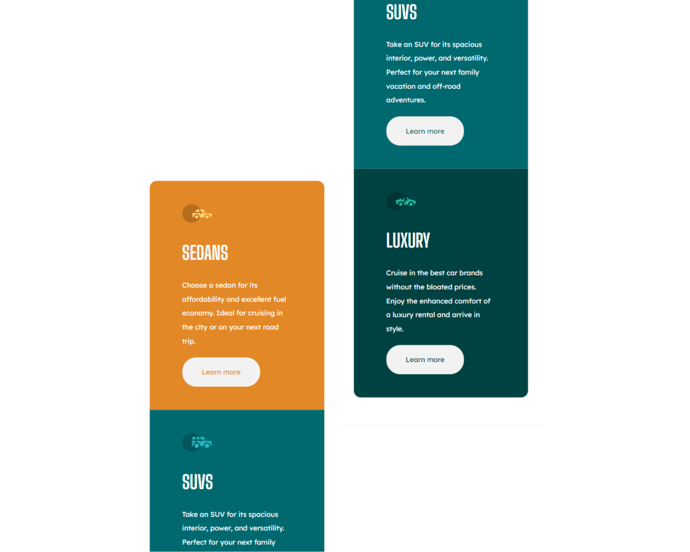
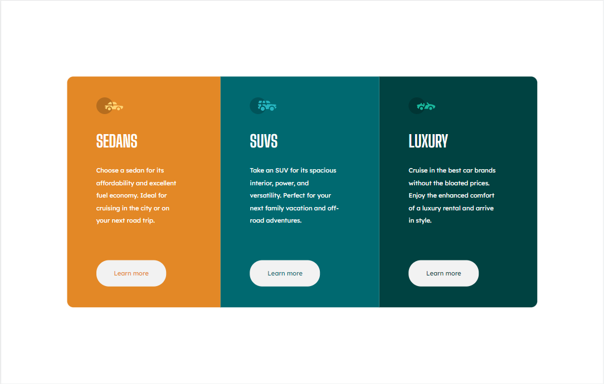

# Frontend Mentor - 3-column preview card component solution

This is a solution to the [3-column preview card component challenge on Frontend Mentor](https://www.frontendmentor.io/challenges/3column-preview-card-component-pH92eAR2-).

## Table of contents

- [Overview](#overview)
  - [The challenge](#the-challenge)
  - [Screenshot](#screenshot)
  - [Links](#links)
- [My process](#my-process)
  - [Built with](#built-with)
  - [What I learned](#what-i-learned)
  - [Useful resources](#useful-resources)
- [Author](#author)

## Overview

In this challenge, we have to deal with the changing of the device's screen size and build the flexible layout. 

### The challenge

Users should be able to:

- View the optimal layout depending on their device's screen size
- See hover states for interactive elements

### Screenshot

For Mobile

For Desktop

Hover states

### Links

- Solution URL: [Add solution URL here](https://your-solution-url.com)
- Live Site URL: [Add live site URL here](https://your-live-site-url.com)

## My process

### Built with

- Semantic HTML5 markup
- CSS custom properties
- Flexbox
- Mobile-first workflow

### What I learned

After this challenge I understand more about the Box model(margin, padding, display) and Flexbox(display, flex-direction, justify-content, align-items, ...) 

### Useful resources

- [w3schools](https://www.w3schools.com/css/)
- [MDN](https://developer.mozilla.org/) 

These two webside are to learn every basic knowledge to build this card challenge.

- [The Web Developer Bootcamp 2022 Course](https://www.udemy.com/course/the-web-developer-bootcamp/) in Udemy. I'm halfway done.

## Author

- Github - [Nguyễn Huỳnh Anh](https://github.com/anhhuynh1506)
- Frontend Mentor - [@anhhuynh1506](https://www.frontendmentor.io/profile/anhhuynh1506)
